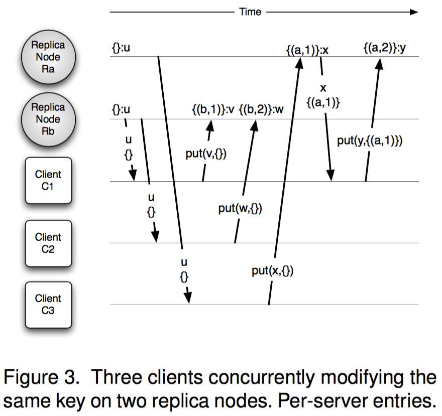

# Causality and optimistic replication

## Upper Bound and Least Upper Bound (LUB)

Simply, the Upper Bound of a non-empty set of numbers is any numbers that is equal or larger than any number in that set.

I.e.
Let \\( S \\) be a non-empty set of real numbers.

Then \\( x \\) is an upper bound for \\( S \\) if \\( x \geq s \space \forall \space s \in S$

And \\( y \\) is a least upper bound for \\( S \\) if \\( y \\) is an upper bound and also \\( y \leq all \space x$

The least-upper-bound property states that any non-empty set of real numbers that has an upper bound must have a least upper bound in real numbers.

### Questions

Based on the definitions upper bound and least upper bound could be equal?

So of a finite set of real numbers you could construct an infinitely large number of sets of upper bounds. But is the set of least upper bounds only relative to the specific set of number and upper bounds?

E.g.

Let \\( S = \left\{ {0, 1, 2, 3} \right\}$

Then we could construct a (finite) set of upper bounds like \\( A = \left\{ {4, 5, 6} \right\} \\). We could have also chosen any of the following:
* \\( \left\{ {3, 4, 5, 6} \right\}$
* \\( \left\{ {5, 6} \right\}$
* \\( \left\{ {6} \right\}$

They are all sets of numbers that fulfill the definition of an upper bound.

Based on the first definition of \\( A \\) would the least upper bound be \\( \left\{ {3, 4} \right\} \\) or \\( \left\{ {3} \right\}$?

Basically, when deciding what are least upper bounds can you consider a subset of possible upper bounds rather than set of all possible ones.

If the former is possible then the various different sets of upper bounds can have different sets of LUBs. If the latter is true then it seems like the LUB will always be \\( {3} \\) for all of the above examples.


## Total Ordering of causal events via real time clocks

> One simple approach is to establish a total order among updates that is compliant with causal dependencies, and use this order to enforce a last writer wins policy. The simplest total order is obtained assuming that client clocks are well synchronized and applying real time clock order (simultaneous events are usually further ordered over process ids).
>
> In this approach, replica nodes never store multiple versions and writes do not need to provide a get context.

There are two drawbacks with this approach:

1. Although we have achieved our partial ordering of causal events we also forced events that are truly concurrent (logically) into a linear order. This can cause previous updates to be overwritten by a client that never saw them, as they didn't exist on a the replica they were talking to. Depending on the semantics of the system and the schema this may be considered data corruption.


2. Synchronising clocks between potentially geographically distant replicas is complicated and desynced clocks will create causality errors.

E.g. a replica with a clock that is always ahead of its peers will always have it's concurrent updates applied , one that's behind will never.

You can eliminate #2 by using logical clocks, such as Lamport Clocks (Vector Clocks) instead of real time ones.


## Partial ordering of causal events using logical clocks

### Using Lamport Clocks

An update consists of a pair \\( (c, r) \\) such that \\( c \\) is a Lamport Clock, or a Vector Clock, which is a general form of a Lamport Clock, and \\( r \\) and a replica id (probably just a number or uuid in practise). Total Causal ordering is then defined as:

Let \\( a \\) and \\( b \\) be two independent updates.

$$
a < b \iff
  a.c < b.c \vee (a.c = b.c \wedge a.r < b.r)
$$


``` rust
use std::cmp::Ordering;

// Obviously it would be more to these two in a real example
type ReplicaId = u64;
type LamportClock = u64;

struct CausalUpdate = {
  clock: LamportClock,
  replica: ReplicaId,
}

impl PartialOrdering for CausalUpdate {
  fn partial_cmp(&self, other: &Self) -> Option<Ordering> {
    if (self.clock == other.clock && self.replica == other.replica) {
      Some(Ordering::Equal)
    } else if self.clock < other.clock ||
        (self.clock == other.clock && self.replica < other.replica) {
      Some(Ordering::Less)
    } else {
      Some(Ordering::Greater)
    }
  }  
}

let a:CausalUpdate = (100, 0);
let b:CausalUpdate = (102, 1);

match a.partial_cmp(b) {
  Ordering::Equal   => printlin('A is equal to B'),
  Ordering::Greater => printlin('A is greater than B'),
  Ordering::Less    => printlin('A is less than B'),
}
```  

Similar to using real time clocks, this method doesn't represent concurrent events. So more recent updates can still clobber older ones.

Consequently, you'd want other mechanisms or checks in play to avoid data loss. E.g. CAS, etc


* http://basho.com/posts/technical/why-vector-clocks-are-easy/
* http://basho.com/posts/technical/why-vector-clocks-are-hard/
* https://www.youtube.com/watch?v=3SWSw3mKApM


### Using Version Vectors

Version Vectors are a vector that contains a causal history of sequential replica events

E.g. The events \\( \left\{{a1 , a2 , b1 , b2 , c1}\right\} \\) could be encoded in a version vector as \\( \left\{{ (a, 2) , (b, 2) , (c, 1)}\right\} \\).


#### Per Server (Replica) entry

Approach 1: Use one entry per replica node in the version vector.

If the system has a fixed and ordered set of nodes then it can be reduced to \\( [2,2,1] \\). You cannot do this in any system where nodes can be added or removed dynamically though.

A client executing a GET and then a PUT operation against a replica for a single key would be:

1. client -> replica: `GET key`
2. replica -> client: `(value, versionVector)`<br />
    The version vector summarises the causal history of that key up to now
3. client -> replica: `PUT KEY (newValue, versionVector)`<br />
    The clients back the version vector as context for the update. Remember that there is potentially a large amount of time between #2 and #3 so `key` may have been updated to a another value since the client saw it.
4. replica increments its local counter to reflect the new update, and stores it in the entry of the received vector corresponding to its own identifier.<br />
    `let replicaId = a`<br />
    `let keyCounter = 2`<br />
    `let versionVector = {(a, 2), (b, 2), (c, 1)}`<br />

    Then an update would increment `keyCounter` to `3` and update `versionVector` to: `{(a, 2), (b, 2), (c, 1), (a, 3)}`<br />

5. replica checks if the new vector causally dominates (is newer) than any version currently stored and discards any version made obsolte.<br />
    e.g. In `{(a, 2), (b, 2), (c, 1), (a, 3)}`: `(a, 3)` causally dominates `(a, 2)` so the vector can be simplified down to `{(b, 2), (c, 1), (a, 3)}`

**Note:** removing data from the vector like in #5 can result in very out of date replicas not being able to resolve causality as it won't have any common history with other replicas.

With the above method we can track causality among updates spread between multiple replicas. Figure 3 shows this approach: if a client were to `GET` from `Ra` and `Rb` would get two conflicting version (`{(a,2)}:y` on `Ra` and `{(b,2)}:w` on `Rb`), which would allow the client to resolve the difference and submit a new version to both replicas.

This approach **cannot** track causality among updates to the same server though. In Figure 3 you can `{(b,1):v}` causally dominating `{(b,2)}:w`, even though these updates are actually concurrent. Updates to the same server are effectively treated in a linear, Last Writer Wins (LWW) fashion.

> This linearization of concurrent updates, due to the use of less version vector entries than sources of concurrent activity, is formalized in Plausible Clocks. The Dynamo system uses one entry per replica node and thus falls into this category.



There are two additional approaches that could be used to mitigate this issue:

1. `Rb` could verify that any new updates are not concurrent with the current version by checking whether the new version would dominate the existing one. If it does the replica could reject the change (i.e. Conditional Write Semantics). This does reduce the guarantee of write availability

2. `Rb` would detect the conflict, as in #1, but then maintain both versions:

> In this case, the problem is that there is no version vector the replica node Rb could generate that traces the dependency with the other version, as {(b, 2)} would be interpreted as overwriting {(b, 1)}.


#### Per Client entry

Approach 2: Use one entry per client in the version vector, where replicas are also clients if they can also update the data via server-side scripts.


1. client -> replica: `GET key`
2. replica -> client:`(value, currentVersionVector)`<br />
    The version vector summarises the causal history of that key up to now
3. client -> replica: `PUT key (value, currentVersionVector, clientId+counter)`<br />
      The client id can be any kind of UUID


In this scenario the client would need to maintain it's own counter. You can generate a new vector for the new version from an existing one by having the client replace it's own value in the vector.

E.g. c1 PUTS, then c2, then c1 again

* `{}`                 -> `{(c1, 1)}`
* `{(c1, 1)}`          -> `{(c1, 1), (c2, 1)}`
* `{(c1, 1), (c2, 1)}` -> `{(c2, 1), (c1, 2)}`

If we wanted to have stateless clients where the client would only provide the new value, the previous vector, and it's uuid then we'd need read your write semantics (See "Session guarantees for weakly consistent replicated data") (obtained, e.g., through read and write quorums), so that the most recent update by a given client is present in the context. (**??I don't fully understand this yet??**)

The replica could also try to infer the most recent update by that client from the version vectors for that key. As a clients updates could have been split been multiple replicas this approach would potentially lose updates made by that client to other replicas.

Figure 4 demonstrates this. You can see that C1's `put(v,{},C1)` against `Rb` will end up being dominated by it's later `put(y, {(c3,1)},c1)`


With the above caveats, this approach will correctly trace causality among concurrent updates from multiple clients. The big downside is that the size of the vectors will grow linearly with the number of clients, potentially limiting the total size of the system.


* http://basho.com/posts/technical/vector-clocks-revisited/
* http://basho.com/posts/technical/vector-clocks-revisited-part-2-dotted-version-vectors/
* https://haslab.wordpress.com/2011/07/08/version-vectors-are-not-vector-clocks/
* https://github.com/ricardobcl/Dotted-Version-Vectors


## Dotted Version Vectors

> Dotted Version Vector Sets are similar to Version Vectors (Vector Clocks for some), but prevent false conflicts that can occur with Version Vectors. It also has a more complete API and is better suited to distributed databases with a get/put interface.


## References

* Dotted Version Vectors: Logical Clocks for Optimistic Replication
* Time, Clocks, and the Ordering of Events in a Distributed System
