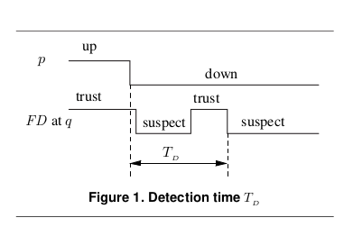
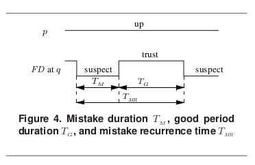
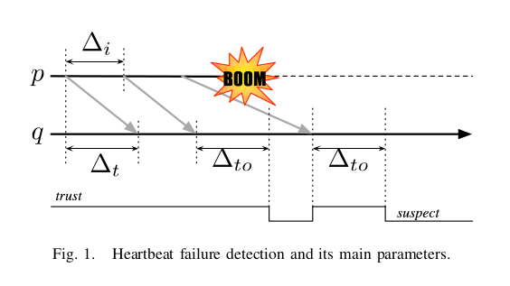
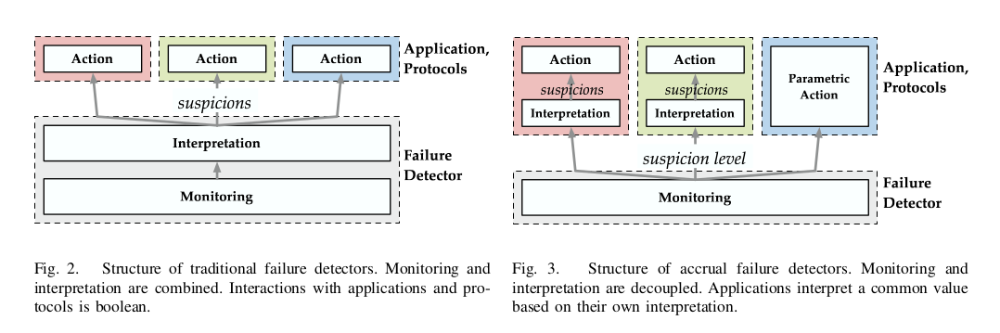

# The φ Accrual Failure Detector

This, or variants of it, is used in a number of systems including Cassandra for failure detection. This doc is a summary of the [paper](https://pdfs.semanticscholar.org/11ae/4c0c0d0c36dc177c1fff5eb84fa49aa3e1a8.pdf) and other relevant sources that this paper builds upon.

## Summary

- Failure detection ought to be a generic service similar to DNS or time synchronisation
- One of the reasons why this hasn't happened is because many approaches to failure detection are tightly coupled to the applications that they monitor.
- I.e. they require "insight" into how the application operates to be able to detect with accuracy
- The φ accrual detector decouples from the app by using a suspicion measure on a continuous scale
- This performs well and is more flexible than approaches using binary suspicion scoring

## Trade offs of failure detectors

All approaches to failure detection exist in a continuum between these two poles

- **Conservative failure detection** Reducing the risk of false positives
- **Aggressive failure detection** Quickly detecting real failures

What is right for a particular application comes down to its specific QoS requirements.

In addition, even if two apps "trigger" failure under the same conditions their responses to that failure may be different.I.e. one may alert but continue and another may begin to aggressively shed load.

## Continuous rather than discreet suspicion

Traditional failure detectors are binary: they either Trust or Suspect the processes that they monitor.

Accrual failure detector monitors output a continuous value that captures the degree of confidences that the monitor has that a specific process has failed.

**core idea** If a process fails then the output value is guaranteed to accrue over time and tend towards infinity.

**core idea** given this continuous output value, it's up to the application to choose the threshold that they act on. This threshold should be based on the apps QoS requirements.

A low threshold will generate more false positives, a high threshold may respond too slowly to real failures.

## Example 1 (from the paper)

> Consider a distributed application in which one of the processes is designated as a master while all other processes play the role of workers. The master holds a list of jobs that needs to be computed and maintains a list of available worker processes.
>
> As long as jobs remain in its list, the master sends jobs to idle workers and collects the results after they have been computed.
Assume now that some of the workers might crash (for simplicity, we assume that the master never crashes).
>
> Let some worker process \\(p_w\\) crash during the execution; the master must be able to detect that \\(p_w\\) has crashed and take appropriate actions, otherwise the system might block forever.
>
> With accrual failure detectors, this could be realized as follows.
>
> When the confidence level reaches some low threshold, the master simply flags the worker process p w and temporarily stops sending new jobs to \\(p_w\\).
>
> Then, when reaching a moderate threshold, the master cancels all unfinished computations that were running on \\(p_w\\) and resubmit them to some other worker processes.
>
> Finally, when reaching a high threshold, the confidence that p w has crashed is high, so the master removes \\(p_w\\) from its list of available workers and releases all corresponding resources. Using conventional failure detectors to implement such a simple behaviour would be quite a challenge.

## Failure Detectors: Basic concepts &  implementations

In a distributed computing system, a failure detector is a computer application or a subsystem that is responsible for the detection of node failures or crashes.

Many problems in distributed systems are not tractable without failure detection. For example, consensus cannot be solved deterministically in asynchronous systems if even a single process might crash [1](#footnote_1).
Essentially, the impossibility results for Consensus (and Atomic Broadcast) stem from the inherent difficulty of determining whether a process has actually crashed or is only "very slow."

### Unreliable failure detectors

This result doesn't hold if the system has an unreliable failure detector oracle [2](#footnote_2). An unreliable failure detector is one that can make mistakes, to a certain degree.

From "Unreliable failure detectors for reliable distributed systems" [2](#footnote_2).

> We characterize a class of failure detectors by specifying the **completeness** and **accuracy** properties that failure detectors in this class must satisfy.

Roughly speaking, **completeness** requires that a failure detector eventually suspects every process that actually crashes, while **accuracy** restricts the mistakes that a failure detector can make.

The Accrual Failure Detector describes a failure detector of class ♦P (eventually perfect), which is sufficient to solve the consensus problem. It has the following properties:

- **Property 1 (Strong completeness)** There is a time after which every process that crashes is permanently suspected by all correct processes.
- **Property 2 (Eventual strong accuracy)** There is a time after which correct processes are not suspected by any correct process.

### QoS of failure detectors

This paper evaluates it's failure detector using the QoS metrics defined in "On the quality of service of failure detectors" [3](#footnote_3).

For all of the following passages, they consider a simple system as follows. The system consists of only two processes called `p` and `q`, where process `q` monitors process `p`. Process `p` can possibly be subject to crash failures, in which case the crash is permanent.

The primary metrics are

> **Detection time (\\(T_D\\) ):** Informally, \\(T_D\\) is the time that
elapses from `p`’s crash to the time when `q` starts suspecting `p` permanently. More precisely, \\(T_D\\) is a random variable representing the time that elapses from the time that `p` crashes to the time when the final S-transition (of the failure detector at `q`) occurs and there are no transitions afterwards (Fig. 1).

We next define some metrics that are used to specify the
accuracy of a failure-detector. Throughout the paper, all accuracy metrics are defined with respect to failure-free runs, i.e. runs in which `p` does not crash.

There are two primary accuracy metrics:

**Mistake recurrence time (\\(T_MR\\)):** this measures the time between two consecutive mistakes. More precisely, \\(T_MR\\) is a random variable representing the time that elapses from an S-transition to the next one. (Fig. 4)

**Mistake duration (\\(T_M\\)):** this measures the time it takes the failure detector to correct a mistake. More precisely, \\(T_M\\) is a random variable representing the time that elapses from an S-transition to the next 
T-transition. (Fig. 4)

As we discussed in the introduction, there are many aspects of failure detector accuracy that may be important to applications. Thus, in addition to \\(T_MR\\) and \\(T_M\\) , we propose four other accuracy metrics in the next section. We selected \\(T_MR\\) and \\(T_M\\) as the primary metrics because, given these two, one can compute the other four.

The derived metrics are:

> **Average mistake rate (\\(λ_M\\)):** this measures the rate at which a failure detector make mistakes, i.e., it is the average number of S-transitions per time unit. This metric is important to long-lived applications where each failure detector mistake (each S-transition) results in a costly interrupt. This is the case for applications such as group membership and cluster management.

**Query accuracy probability (\\(P_A\\)):** this is the probability that the failure detector’s output is correct at a random time. This metric is important to applications that interact with the failure detector by querying it at random times.

Many applications can make progress only during good
periods — periods in which the failure detector makes no
mistakes. This observation leads to the following two metrics.

**Good period duration (\\(T_G\\)):** this measures the length of a good period. More precisely, \\(T_G\\) is a random variable representing the time that elapses from a T-transition to the next S-transition (Fig. 4). 

For short-lived applications, however, a closely related metric may be more relevant. Suppose that an application is started at a random time in a good period. If the remaining part of the good period is long enough, the short-lived application will be able to complete its task. The metric that
measures the remaining part of the good period is:

**Forward good period duration (\\(T_{FG}\\)):** this is a random variable representing the time that elapses from a random time at which `q` trusts `p`, to the time of the next S-transition. At first sight, it may seem that, on the average, \\(T_FG\\) is just half of \\(T_G\\) (the length of a good period). But this is incorrect, and in Section 2.4 we give the actual relation between \\(T_{FG}\\) and \\(T_G\\).

One final piece of useful context for evaluating QoS of failure detectors (page 5 of [3](#footnote_3)): 

> ...assume that in failure-free runs, the probabilistic distribution of failure detector histories is ergodic. Roughly speaking, this means that in failure-free runs, the failure detector slowly “forgets” its past history: from any given time on, its future behavior may depend only on its recent behavior.

We call failure detectors satisfying this ergodicity condition ergodic failure detectors.

For the Accrual Failure Detector paper, the following subset of the QoS metrics are used:

- **Definition 1 (Detection time \\(T_D\\)):** The detection time is the time that elapses since the crash of `p` and until `q` begins to suspect `p` permanently.
- **Definition 2 (Average mistake rate \\(λ_M\\)):** This measures the rate at which a failure detector generates wrong suspicions.

**Note** The first definition relates to the completeness whereas the other one relates to the accuracy of the failure detector.

### Heartbeat failure detectors

Heartbeat messages is a common approach to implementing failure detectors.

**Note**: This pattern assumes that processes have access to a local physical clock that allows them to measure time. It does not assume that the clocks are synchronised

It works as follows

1. A monitor process (`p`) sends a heartbeat message to process `q`, informing `q` that `p` is still alive. The period is called the heartbeat interval \\(\Delta i\\)
2. 

### Accrual failure detectors

## References

1.  M. J. Fischer, N. A. Lynch, and M. S. Paterson, “Impossibility of distributed consensus with one faulty process,” J. ACM, vol. 32,
no. 2, pp. 374–382, 1985.
2.  T. D. Chandra and S. Toueg, “Unreliable failure detectors for reliable distributed systems,” J. ACM, vol. 43, no. 2, pp. 225–267, 1996. [https://sci-hub.tw/10.1145/226643.226647](https://sci-hub.tw/10.1145/226643.226647)
3.  W. Chen, S. Toueg, and M. K. Aguilera, “On the quality of service of failure detectors,” IEEE Trans. Comput., vol. 51, no. 5, pp.
561–580, May 2002. [https://sci-hub.tw/10.1109/ICDSN.2000.857535](https://sci-hub.tw/10.1109/ICDSN.2000.857535)

## Further reading

* [Cassandra and its Accrual Failure Detector](http://ljungblad.nu/post/44006928392/cassandra-and-its-accrual-failure-detector)
